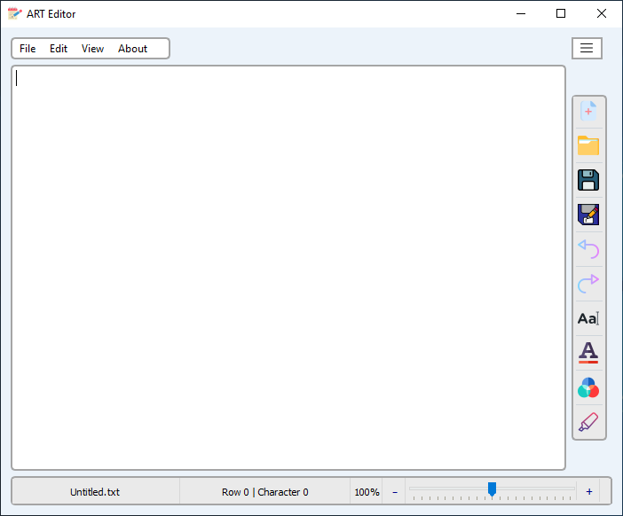

# ART-Editor
This application is a Text Editor with different abilities was generated with PyQt5 and made by "Amirreza Tavallaei".

For use this you should install PyQt5 module in Python.

For this you should write this code in Command Prompt:

```bash
pip install PyQt5
```

# ScreenShot

</img>
